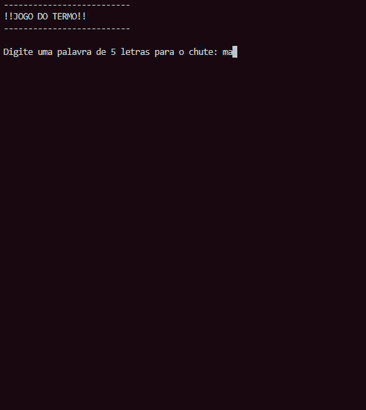

# Jogo do Termo



## Projeto

Desenvolvido durante o curso Fullstack da [Academia do Programador](https://www.academiadoprogramador.net) 2026

## 🕹️ Sobre o Jogo
O Termo é um jogo de adivinhação de palavras inspirado no popular Wordle. O objetivo é descobrir uma palavra secreta de 5 letras em um número limitado de tentativas, utilizando feedbacks visuais coloridos para guiar as estratégias do jogador.

## 🛠️ Funcionalidades
**Sorteio Aleatório:** A cada nova partida, uma palavra de 5 letras é selecionada aleatoriamente de um banco de dados interno.

**Sistema de Tentativas:** O jogador tem até 5 chances para descobrir a palavra correta.

Interface no Console: O jogo roda inteiramente via terminal, com mensagens claras e interativas.

## 🎨 Regras e Feedback Visual
Após cada tentativa, o jogo processa a palavra digitada e aplica cores para indicar o status de cada letra:

🟥 **Vermelho:** A letra não existe na palavra secreta.

🟨 **Amarelo:** A letra existe na palavra, mas está na posição errada.

🟩 **Verde:** A letra está correta e na posição exata.

🏆 Condições de Finalização:

**Vitória:** Ocorre quando o jogador acerta as 5 letras nas posições corretas. Uma mensagem de sucesso é exibida.

**Derrota:** Ocorre caso as 5 tentativas se esgotem sem o acerto da palavra. O jogo revela a palavra oculta e encerra a partida.

## 🚀 Como Executar o Projeto
Para rodar o jogo no seu computador, siga os passos abaixo:

1. **Pré-requisitos:** Certifique-se de ter o SDK do .NET (versão 6.0 ou superior) instalado em sua máquina. Você pode verificar digitando `dotnet --version` no seu terminal.

2. **Clonar ou Baixar o Repositório:** Baixe os arquivos do projeto para o seu computador.

3. **Abrir o Terminal:** Abra o terminal do seu sistema (ou o terminal integrado do VS Code) e navegue até a pasta raiz do projeto.

4. **Entrar na pasta do Aplicativo:** Como o código principal está em uma subpasta, você precisa entrar nela antes de executar:
   ```bash
   cd Termo.ConsoleApp
5. Clone o repositório ou baixe o código comprimido em .zip.
6. Abra o emulador de terminal e navegue até a pasta raiz.
7. Utilize o comando abaixo para restaurar as dependências do projeto.

   ```
   dotnet restore
   ```

8. Em seguida compile e execute o projeto com o comando:

   ```
   dotnet run --project JogoDaForca.ConsoleApp
   ```
## Requisitos

- .NET SDK 10.0